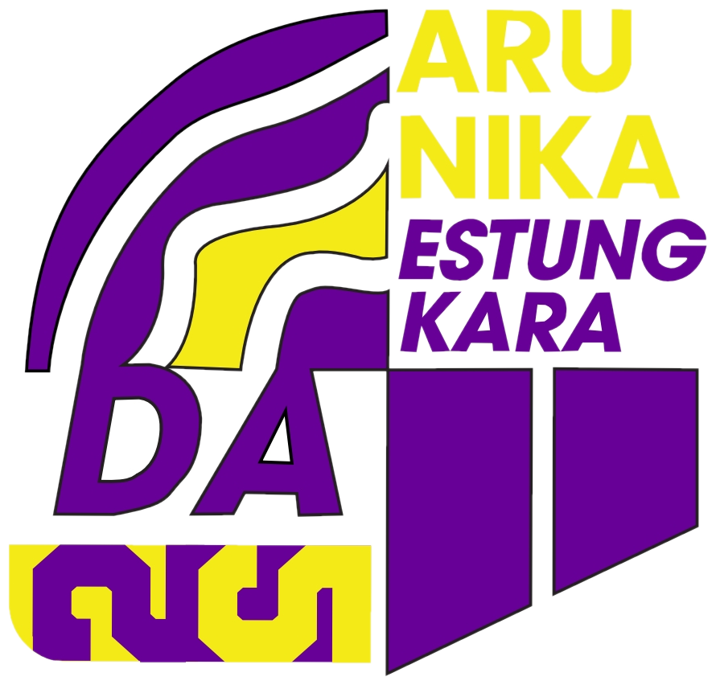

<div align="center">

  <!-- Logo Dewan Ambalan (Transparan Tanpa Background) -->
  <a href="https://github.com/fiko30/Website-Dewan-Ambalan-2026">
    
  </a>

  <br/><br/>

  # ⚜️ WEBSITE SELEKSI DEWAN AMBALAN 2026 ⚜️
  ### *Platform Cerdas Rekapitulasi Penilaian & Pengumuman Kelulusan Calon Dewan Ambalan*

  <!-- Typing SVG Dynamic Banner -->
  <p align="center">
    <a href="https://github.com/fiko30/Website-Dewan-Ambalan-2026">
      
    </a>
  </p>

  <!-- Modern Tech Stack Dock (SkillIcons) -->
  <p align="center">
    <a href="#-teknologi--tech-stack">
      
    </a>
  </p>

  <!-- Status Badges -->
  <p align="center">
    
    
    
    
    
    
  </p>

</div>

---

<!-- MODERN QUICK NAVIGATION BAR -->
<p align="center">
  <a href="#-tentang-proyek"></a>
  <a href="#-fitur-unggulan"></a>
  <a href="#-arsitektur--alur-sistem"></a>
  <a href="#-teknologi--tech-stack"></a>
  <a href="#-struktur-repositori"></a>
  <a href="#-panduan-instalasi-lokal"></a>
  <a href="#-deployment-cloud--docker"></a>
</p>

---

## 📑 Daftar Isi 

<details open>
<summary><b>🔍 Klik untuk Melihat / Menyembunyikan Peta Navigasi Cepat</b></summary>
<br/>

| No | Modul | Fokus Bahasan | Pintasan Langsung |
| :---: | :--- | :--- | :---: |
| **01** | 🧭 **Ikhtisar** | Latar belakang, tujuan, & value proposition sistem | [Kunjungi](#-tentang-proyek) |
| **02** | 💎 **Fitur Unggulan** | Panel Admin, Portal Peserta, Scoring 3 Pos, Cetak Hasil | [Kunjungi](#-fitur-unggulan) |
| **03** | 🧩 **Arsitektur Sistem** | Alur autentikasi, session isolation, & connection pool | [Kunjungi](#-arsitektur--alur-sistem) |
| **04** | 🛠️ **Teknologi** | Showcase stack modern & spesifikasi library | [Kunjungi](#-teknologi--tech-stack) |
| **05** | 🗂️ **Struktur Berkas** | Blueprint folder dan peran setiap komponen | [Kunjungi](#-struktur-repositori) |
| **06** | ⚡ **Quickstart Lokal** | Setup via Laragon / XAMPP, konfigurasi `.env`, impor DB | [Kunjungi](#-panduan-instalasi-lokal) |
| **07** | 🐳 **Container & Cloud** | Menjalankan dengan Docker & deployment instan di Railway | [Kunjungi](#-deployment-cloud--docker) |
| **08** | 🔑 **Kredensial Bawaan** | Akun default administrator dan calon peserta | [Kunjungi](#-kredensial-bawaan--akun-default) |
| **09** | 🛡️ **Pilar Keamanan** | Sanitasi variabel lingkungan, prepared statements, role guard | [Kunjungi](#-standar-keamanan) |

</details>

---

## 📖 Tentang Proyek

**Website Seleksi Dewan Ambalan 2026** adalah aplikasi berbasis web yang dibangun secara khusus untuk menunjang keterbukaan, ketertiban administratif, dan otomasi perhitungan skor dalam rangkaian seleksi Dewan Ambalan Pramuka Penegak.

Peralihan dari format rekapitulasi konvensional (kertas / spreadsheet manual) ke sistem terintegrasi ini memberikan manfaat nyata:
- ⏱️ **Efisiensi Waktu**: Otomatisasi akumulasi nilai dan penentuan kelulusan instan.
- 🎯 **Akurasi Tinggi**: Mencegah kesalahan human-error saat input maupun perhitungan total skor.
- 🌐 **Aksesibilitas Luas**: Desain adaptif berbasis mobile-first memungkinkan peserta mengecek hasil pengumuman langsung dari ponsel cerdas mereka.
- 🎨 **Estetika Modern**: Antarmuka berbasis **Glassmorphism Theme** bergradien ungu-violet dengan backdrop-blur yang elegan dan responsif.

---

## ✨ Fitur Unggulan

```
┌─────────────────────────────────────────────────────────────────────────┐
│                      FITUR UTAMA SISTEM SELEKSI                         │
├────────────────────────────────────┬────────────────────────────────────┤
│   🛡️ PANEL ADMINISTRATOR (ADMIN)       🎓 PORTAL PESERTA (SISWA/CALON) │
├────────────────────────────────────┼────────────────────────────────────┤
│ • Manajemen Data Peserta Lengkap   │ • Login Personal & Aman            │
│ • Input Nilai 3 Pos Seleksi Utama  │ • Transparansi Rincian Nilai       │
│ • Pengaturan KKM Dinamis Realtime  │ • Status Kelulusan (Lulus/Gagal)   │
│ • Auto-generate Akun Login Default │ • Unduh / Cetak Resmi Slip Hasil   │
│ • Filter Pencarian Cepat & Edit    │ • Tampilan Responsif Smartphone    │
└────────────────────────────────────┴────────────────────────────────────┘
```

### 1. 🛡️ Modul Administrator
- **Dashboard Metrik Statistik**: Tinjauan ringkas total pendaftar, jumlah peserta lulus, jumlah belum lulus, dan rata-rata skor.
- **Form Penilaian Multi-Pos**:
  - 📝 **Tes Tulis**: Mengukur pengetahuan umum, kepramukaan, dan analisis masalah (Skor: 0 - 100).
  - 🗣️ **Wawancara**: Menilai kepemimpinan, kepribadian, integritas, dan loyalitas ambalan (Skor: 0 - 100).
  - 📑 **CV, Program Kerja & Visi Misi**: Menimbang orisinalitas gagasan dan kesiapan rencana kerja (Skor: 0 - 100).
- **Pengubah KKM Instan**: Standar kelulusan (KKM) dapat disesuaikan sewaktu-waktu sesuai kuota atau hasil rapat Dewan Kehormatan tanpa perlu menyentuh kode program.

### 2. 🎓 Modul Peserta
- **Status Kelulusan Otomatis**: Peserta melihat langsung status kelulusan mereka berdasarkan akumulasi nilai akhir terhadap KKM.
- **Slip Hasil Seleksi Cetak**: Disediakan tombol langsung cetak (*printable view*) berformat rapi untuk arsip fisik peserta.

---

## 🏛️ Arsitektur & Alur Sistem

Sistem dirancang dengan arsitektur berlapis yang modular, aman, dan efisien:

```text
┌────────────────────────────────────────────────────────────────────────────┐
│                            🌐 1. CLIENT LAYER                              │
│   [ Calon Peserta / Siswa ]                    [ Admin / Tim Penilai ]     │
│              │                                            │                │
│              ▼                                            ▼                │
│    Landing Page (index.php)                  Login Portal (user/login.php) │
└─────────────────────────────────────┬──────────────────────────────────────┘
                                      │ Validasi Kredensial & Sesi
                                      ▼
┌────────────────────────────────────────────────────────────────────────────┐
│                        🛡️ 2. AUTH & ACCESS GUARD                           │
│                       [ Role Verification Engine ]                         │
│                 ┌───────────────────┴───────────────────┐                  │
│                 ▼                                       ▼                  │
│       Role: Peserta (Siswa)                   Role: Administrator          │
└─────────────────┬───────────────────────────────────────┬──────────────────┘
                  │                                       │
                  ▼                                       ▼
┌─────────────────────────────────────┐ ┌────────────────────────────────────┐
│       🎓 3A. PORTAL PESERTA         │ │     🛡️ 3B. PANEL ADMINISTRATOR     │
│ • Dashboard Nilai & Status Lulus    │ │ • Input Nilai 3 Pos Seleksi Utama  │
│ • Transparansi Rincian Skor Pos     │ │ • Manajemen Ambang Batas (KKM)     │
│ • Unduh / Cetak Slip Hasil Resmi    │ │ • Rekapitulasi & Manajemen Peserta │
└─────────────────┬───────────────────┘ └─────────────────┬──────────────────┘
                  │                                       │
                  └───────────────────┬───────────────────┘
                                      │ Prepared Statements (MySQLi Pool)
                                      ▼
┌────────────────────────────────────────────────────────────────────────────┐
│                   🗄️ 4. DATABASE & STORAGE LAYER (MySQL)                   │
│   • users (Akun & Role)                  • penilaian (Skor 3 Pos Seleksi)  │
│   • app_settings (Ambang Batas KKM)      • Terisolasi Aman via .env        │
└────────────────────────────────────────────────────────────────────────────┘
```

### 🔄 Alur Aliran Data (Data Flow Pipeline)

| Tahap | Modul & Entitas | File Rujukan | Deskripsi Alur Kerja |
| :---: | :--- | :--- | :--- |
| **01** | **Gerbang Akses** | `index.php` & `user/login.php` | Peserta maupun admin masuk melalui portal antarmuka dan mengisi autentikasi kredensial. |
| **02** | **Proteksi Sesi** | *Role Verification Guard* | Sistem memvalidasi status login serta hak akses (mencegah bypass URL tanpa login). |
| **03** | **Panel Admin** | `admin/dashboard.php` | Administrator menginput nilai 3 pos seleksi, memperbarui batas KKM, dan mengelola peserta. |
| **04** | **Portal Peserta** | `user/dashboard.php` | Peserta melihat transparansi akumulasi nilai dan status kelulusan otomatis secara real-time. |
| **05** | **Cetak Slip Hasil** | `user/download_hasil.php` | Peserta mencetak bukti pengumuman kelulusan resmi dalam format dokumen siap cetak. |
| **06** | **Penyimpanan Data** | `config/config.php` | Eksekusi query terlindungi menggunakan *Prepared Statements* ke database MySQL. |

---

## ⚡ Teknologi / Tech Stack

Kombinasi teknologi yang efisien, handal, dan mudah dijalankan di berbagai lingkungan:

| Teknologi | Kategori | Logo | Fungsi & Kegunaan |
| :--- | :---: | :---: | :--- |
| **PHP 8.2+** | Backend Engine |  | Pemrosesan logika bisnis, session handling, dan pooling koneksi MySQLi |
| **MySQL 8.0** | Basis Data |  | Penyimpanan relasional user, nilai penilaian, dan konfigurasi dinamis |
| **HTML5** | Semantic Web |  | Struktur dokumen modern dengan standar aksesibilitas tinggi |
| **CSS3** | Modern Styling |  | Glassmorphism, CSS Grid, Flexbox, & Backdrop Blur responsive |
| **JavaScript** | Frontend Dynamic |  | Interaktivitas form, toggle password, dan validasi sisi klien |
| **Docker** | Kontainerisasi |  | Portabilitas deployment yang identik antara lokal dan produksi |
| **Git & GitHub** | Version Control |  | Manajemen repositori, riwayat komit, dan kolaborasi tim |

---

## 📂 Struktur Repositori

```
website-dewan-ambalan-2026/
├── 📁 admin/
│   └── 📄 dashboard.php         # Panel kontrol utama, tabel penilaian, & setting KKM
├── 📁 assets/
│   ├── 🖼️ logo-da.png           # Logo transparan resmi Dewan Ambalan
│   ├── 🖼️ Logo Dewan Ambalan.jpeg
│   └── 📁 css/
│       └── 📄 style.css         # Gaya visual custom & komponen glassmorphism
├── 📁 config/
│   └── 📄 config.php            # Loader .env, Singleton Database Pool, & helper KKM
├── 📁 user/
│   ├── 📄 dashboard.php         # Halaman hasil kelulusan & skor siswa
│   ├── 📄 download_hasil.php    # Slip pengumuman kelulusan resmi siap cetak
│   ├── 📄 login.php             # Halaman autentikasi akun terpadu
│   └── 📄 logout.php            # Pembersihan sesi aman
├── 📄 .env.example              # Blueprint variabel lingkungan database
├── 📄 .gitignore                # Proteksi agar kredensial rahasia tidak terunggah
├── 📄 database.sql              # Skema tabel (users, penilaian, app_settings)
├── 📄 Dockerfile                # Konfigurasi containerized image PHP
├── 📄 index.php                 # Halaman portal selamat datang
├── 📄 LICENSE                   # Lisensi open-source MIT
└── 📄 README.md                 # Dokumentasi komprehensif proyek
```

---

## 🚀 Panduan Instalasi Lokal

### 1. Kloning Repositori
Jalankan terminal dan clone repositori ini ke folder server lokal Anda (misal `htdocs` XAMPP atau `www` Laragon):
```bash
git clone https://github.com/fiko30/Website-Dewan-Ambalan-2026.git
cd Website-Dewan-Ambalan-2026
```

### 2. Atur Konfigurasi Basis Data (`.env`)
Salin berkas template lingkungan:
```bash
cp .env.example .env
```
Buka berkas `.env` dan sesuaikan dengan kredensial database lokal:
```env
DB_HOST=localhost
DB_USER=root
DB_PASS=
DB_NAME=seleksi_da
DB_PORT=3306
```

### 3. Impor Database
1. Buat database baru di MySQL bernama `seleksi_da`.
2. Impor berkas [`database.sql`](database.sql) ke dalam database tersebut melalui **phpMyAdmin**, **HeidiSQL**, atau CLI:
```bash
mysql -u root -p seleksi_da < database.sql
```

### 4. Buka di Browser
Akses aplikasi melalui peramban:
```
http://localhost/seleksi_da/
```
Atau gunakan web server bawaan PHP:
```bash
php -S localhost:8000
```
Lalu kunjungi `http://localhost:8000`.

---

## ☁️ Deployment Cloud & Docker

### 🐳 Menjalankan dengan Docker

Proyek sudah dilengkapi dengan [`Dockerfile`](Dockerfile) yang siap digunakan:

```bash
# 1. Build image
docker build -t dewan-ambalan-app .

# 2. Jalankan container
docker run -d -p 8080:80 \
  -e DB_HOST=host.docker.internal \
  -e DB_USER=root \
  -e DB_PASS=password_database \
  -e DB_NAME=seleksi_da \
  -e DB_PORT=3306 \
  --name dewan-ambalan-web dewan-ambalan-app
```
Akses container pada: `http://localhost:8080`.

---

### 🚂 Deployment ke Railway

Aplikasi telah dioptimalkan untuk cloud hosting [Railway](https://railway.app/):

1. **Buat Proyek Baru**: Sambungkan repositori GitHub ini ke dashboard Railway.
2. **Tambah Database**: Tambahkan layanan **MySQL Database** di canvas Railway.
3. **Konfigurasi Environment**: Tambahkan variabel lingkungan pada service web:
   ```env
   DB_HOST=${{MySQL.MYSQLHOST}}
   DB_USER=${{MySQL.MYSQLUSER}}
   DB_PASS=${{MySQL.MYSQLPASSWORD}}
   DB_NAME=${{MySQL.MYSQLDATABASE}}
   DB_PORT=${{MySQL.MYSQLPORT}}
   ```
4. **Impor Schema**: Gunakan connection string Railway untuk mengimpor berkas `database.sql`.
5. Web app akan langsung aktif dan memiliki domain publik otomatis!

---

## 🔑 Kredensial Bawaan & Akun Default

Pada saat impor skema `database.sql`, sistem telah menyediakan akun awal:

| Akun / Hak Akses | Username / Nama Lengkap | Password Bawaan | Deskripsi |
| :--- | :--- | :--- | :--- |
| 🛡️ **Administrator** | `Admin DA` | `Dewan Ambalan 2025` | Hak penuh mengelola nilai, data peserta, dan standar KKM |
| 🎓 **Calon Peserta Baru** | *(Nama Peserta)* | `Calon Dewan Ambalan 2026` | Akun otomatis terbuat saat admin mendaftarkan peserta baru |

> 🔒 **Himbauan Keamanan**: Segera ganti password akun administrator setelah melakukan instalasi pertama!

---

## 🛡️ Standar Keamanan

- 🔐 **Kredensial Terisolasi**: Seluruh kredensial rahasia (host, password, nama database) dipisahkan ke dalam `.env` dan tidak tersimpan di repositori publik.
- 💉 **Bebas SQL Injection**: Setiap parameter input diproses melalui **MySQLi Prepared Statements** dengan pemetaan tipe data ketat (`bind_param`).
- 🛑 **Proteksi Sesi Role-Based**: Mencegah eksploitasi URL transversal; akun siswa tidak dapat membuka dashboard admin tanpa session token yang sah.
- 🧹 **Sanitasi XSS**: Output data peserta di-render menggunakan `htmlspecialchars()` untuk menetralkan script berbahaya.

---

## 🤝 Kontribusi & Dukungan

Kontribusi selalu terbuka! Jika Anda ingin menambahkan fitur atau memperbaiki bug:
1. **Fork** repositori ini
2. Buat branch fitur baru (`git checkout -b fitur/FiturKeren`)
3. Lakukan commit perubahan (`git commit -m 'feat: Tambah fitur baru'`)
4. Push ke branch (`git push origin fitur/FiturKeren`)
5. Buat **Pull Request**

---

<div align="center">

  <b>Satyaku Kudarmakan, Darmaku Kubaktikan ⚜️</b><br/>
  <i>Ikhlas Bakti Bina Bangsa, Berbudi Bawa Laksana. Salam Pramuka!</i>

</div>
